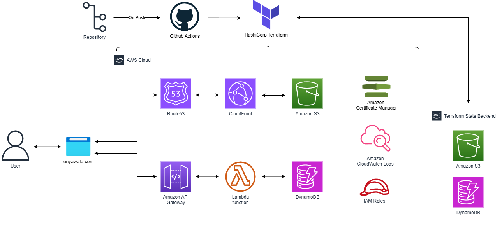

# Cloud Resume Project

## Overview
This project hosts my personal resume as a static website on AWS, managed entirely with Terraform and deployed via GitHub Actions.

- **Static resume website** hosted on **S3** + **CloudFront**  
- **Visitor counter** backed by **API Gateway** → **Lambda** → **DynamoDB**  
- **Remote state** stored in **S3** with **DynamoDB** locking 

## Architecture Diagram

# 🚀 Resources That Helped Me

## 📺 YouTube

- [@wahlnetwork](https://www.youtube.com/@wahlnetwork)  
  Great for learning Terraform and cloud tools

- [4 Considerations to Structure Terraform Code](https://www.youtube.com/watch?v=qKxQeB5pq7k)  
  by *This is GitOps*

## 📘 Books

- *The DevOps Handbook*  
  Still reading this one—been great so far!

## 🌐 Online Articles

- [150+ blogposts by others who did the challenge](https://medium.com/tag/cloud-resume-challenge)

- [DevOps.dev](https://devops.dev)

## 🎓 Courses

- [Stephane Maarek on Udemy](https://www.udemy.com/user/stephane-maarek/)  
  Great if you’re new to AWS cloud